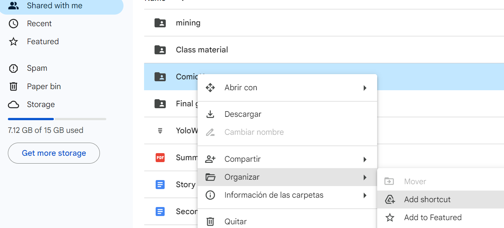

# Colab Tutorial
Go to this [drive folder](https://drive.google.com/drive/folders/1RrPJuVRm8kxqPey37YiuRxztmP-zEyxP?usp=sharing) and create a shortcut on your drive (see figure below).\\
\\
Once you have completed the previous step, you can run the tutorial: [Example of usage for Comic Mischief and Hate Speech datasets](https://colab.research.google.com/github/iltocl/dcc-tutorial-multizoo-multibench/blob/main/comic_hate_example.ipynb)

# dcc-tutorial-multizoo-multibench
This tutorial is aimed to provide a general description of the multizoo and multibench sources as well as practical examples of how to use it 

- [Multizoo and Multibench Tutorial](#dcc-tutorial-multizoo-multibench)
  - [Summary](#summary)
  - [Getting Started](#getting-started)
      - [Code Structure](#code-structure)
  - [Media Coverage](#media-coverage)

# Summary

# Getting Started
## Code Structure
```
├── 
│   ├── 
│   ├── 
└── README.md
```

# Media Coverage
